<h1 align="center">Aerosoft Bombardier CRJ 550/700/900/1000 Collection
</h1> 

The Aerosoft CRJ set of planes are payware available for purchase as a bundle here: https://www.aerosoft.com/en/microsoft-flight-simulator/msfs-aircraft/3305/aerosoft-aircraft-crj-bundle?number=AS15238

## EASY SINGLE IMPORT DOWNLOAD
These are single file import that contains all the instruments noted below for the section and date as noted.
This single file download does not automatically get updated so be sure to check the date.
- [Overhead Instruments 5-09-22 CLICK HERE TO DOWNLOAD SINGLE FILE](https://github.com/Simstrumentation/Air-Manager/blob/main/Instruments/Bombardier_CRJ/Bombardier_CRJ-Overhead-ALL_Panels_5-9-22.siff?raw=true) 
- [Pedestal Instruments 10-09-22 CLICK HERE TO DOWNLOAD SINGLE FILE](https://github.com/Simstrumentation/Air-Manager/blob/main/Instruments/Bombardier_CRJ/Bombardier_CRJ-Pedestal-ALL_Panels_10-9-22.siff?raw=true) 

To save time, we've created a portrait and landscape layout (Air Manager calls them "Panels") with the instruments already layed out. Just download and import the file linked below, then click the button to add a new Panel, in the search type in "CRJ".
- [Overhead Landscape or Portrait Layout CLICK HERE TO DOWNLOAD](https://github.com/Simstrumentation/Air-Manager/blob/main/Instruments/Bombardier_CRJ/Bombardier_CRJ-Overhead_Panel_Layout.siff?raw=true)
- [Pedestal Layout CLICK HERE TO DOWNLOAD](https://github.com/Simstrumentation/Air-Manager/blob/main/Instruments/Bombardier_CRJ/Bombardier_CRJ-Pedestal_Panel_Layout.siff?raw=true)

## Screenshots
| Overhead Day | Overhead Night |
| ------------- |:-------------:|
 |  |

| Pedestal Day | Pedestal Night |
| ------------- |:-------------:|
 |  |

 
 

## Overhead Instruments

| Instrument | Download Current Version | Documentation | Preview |
| ---------- | ------------------------ | ------------- | ------- |
| Overhead-Air Conditioning Panel | [v1.0 03-29-2022](https://github.com/Simstrumentation/Air-Manager/blob/main/Instruments/Bombardier_CRJ/CRJ-Overhead-Air_Conditioning_Panel/Bombardier_CRJ-Overhead-Air_Conditioning_Panel.siff?raw=true) | [docs](CRJ-Overhead-Air_Conditioning_Panel/) | 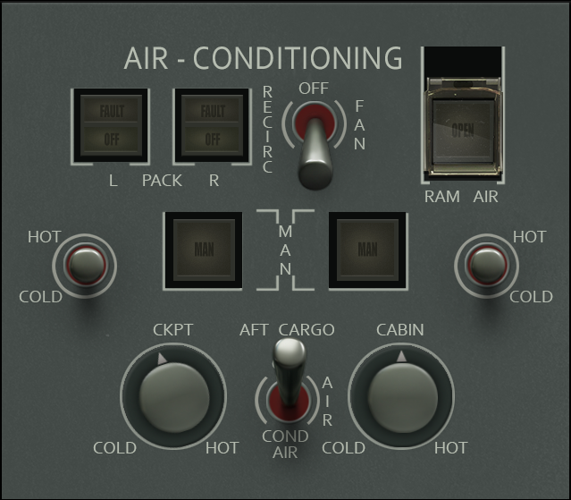 |
| Overhead-Anti Ice Panel | [v1.0 03-24-2022](https://github.com/Simstrumentation/Air-Manager/blob/main/Instruments/Bombardier_CRJ/CRJ-Overhead-Anti_Ice_Panel/Bombardier_CRJ-Overhead-Anti_Ice_Panel.siff?raw=true) | [docs](CRJ-Overhead-Anti_Ice_Panel/) | 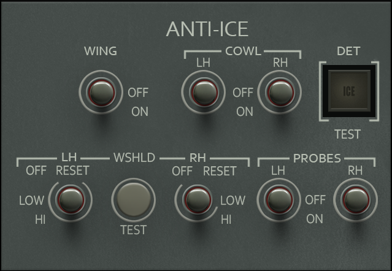 |
| Overhead-APU Panel | [v1.0 03-22-2022](https://github.com/Simstrumentation/Air-Manager/blob/main/Instruments/Bombardier_CRJ/CRJ-Overhead-APU_Panel/Bombardier_CRJ-Overhead-APU_Panel.siff?raw=true) | [docs](CRJ-Overhead-APU_Panel/) | 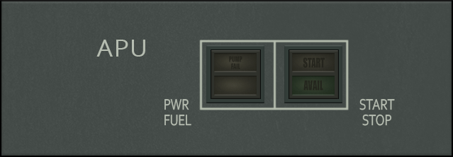 |
| Overhead-Bleed Air Panel | [v1.0 02-09-2022](https://github.com/Simstrumentation/Air-Manager/blob/main/Instruments/Bombardier_CRJ/CRJ-Overhead-Bleed_Air_Panel/Bombardier_CRJ-Overhead-Bleed_Air_Panel.siff?raw=true) | [docs](CRJ-Overhead-Bleed_Air_Panel/) | 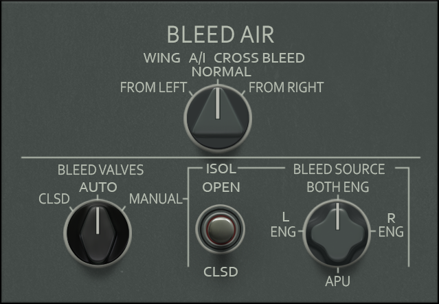 |
| Overhead-Cabin Pressure Panel | [v1.0 03-27-2022](https://github.com/Simstrumentation/Air-Manager/blob/main/Instruments/Bombardier_CRJ/CRJ-Overhead-Cabin_Press_Panel/Bombardier_CRJ-Overhead-Cabin_Pressure_Panel.siff?raw=true) | [docs](CRJ-Overhead-Cabin_Press_Panel/) | 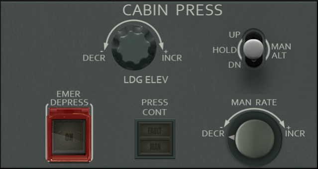 |
| Overhead-Electrical Power Panel | [v1.0 02-09-2022](https://github.com/Simstrumentation/Air-Manager/blob/main/Instruments/Bombardier_CRJ/CRJ-Overhead-Electrical_Power_Panel/Bombardier_CRJ-Overhead-Electrical_Power_Panel.siff?raw=true) | [docs](CRJ-Overhead-Electrical_Power_Panel/) | 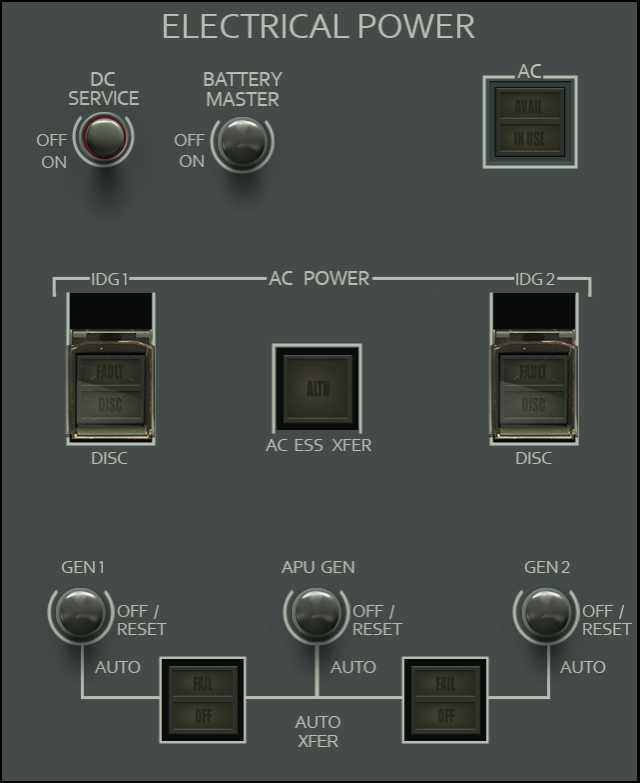 |
| Overhead-External Lights Panel | [v1.0 03-16-2022](https://github.com/Simstrumentation/Air-Manager/blob/main/Instruments/Bombardier_CRJ/CRJ-Overhead-External_Light_Panel/Bombardier_CRJ-Overhead-External_Lights_Panel.siff?raw=true) | [docs](CRJ-Overhead-External_Light_Panel/) | 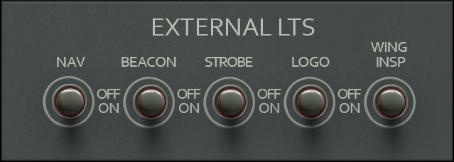 |
| Overhead-Fire Test Panel | [v1.0 03-16-2022](https://github.com/Simstrumentation/Air-Manager/blob/main/Instruments/Bombardier_CRJ/CRJ-Overhead-Fire_Test_Panel/Bombardier_CRJ-Overhead-Fire_Test_Panel.siff?raw=true) | [docs](CRJ-Overhead-Fire_Test_Panel/) |  |
| Overhead-Fuel Panel | [v1.0 04-22-2022](https://github.com/Simstrumentation/Air-Manager/blob/main/Instruments/Bombardier_CRJ/CRJ-Overhead-Fuel_Panel/Bombardier_CRJ-Overhead-Fuel_Panel.siff?raw=true) | [docs](CRJ-Overhead-Fuel_Panel/) |  |
| Overhead-Hydraulic SOV Panel | [v1.0 03-27-2022](https://github.com/Simstrumentation/Air-Manager/blob/main/Instruments/Bombardier_CRJ/CRJ-Overhead-Hydraulic_SOV_Panel/Bombardier_CRJ-Overhead-Hydraulic_SOV_Panel.siff?raw=true) | [docs](CRJ-Overhead-Hydraulic_SOV_Panel/) | 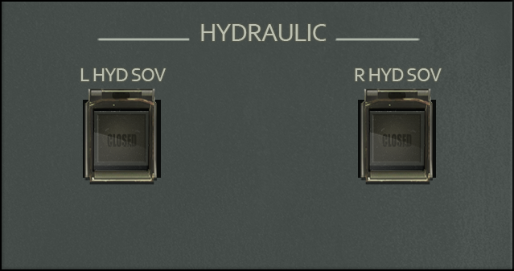 |
| Overhead-Hydraulic Switches Panel | [v1.0 03-16-2022](https://github.com/Simstrumentation/Air-Manager/blob/main/Instruments/Bombardier_CRJ/CRJ-Overhead-Hydraulic_Switches_Panel/Bombardier_CRJ-Overhead-Hydraulic_Switches_Panel.siff?raw=true) | [docs](CRJ-Overhead-Hydraulic_Switches_Panel/) | 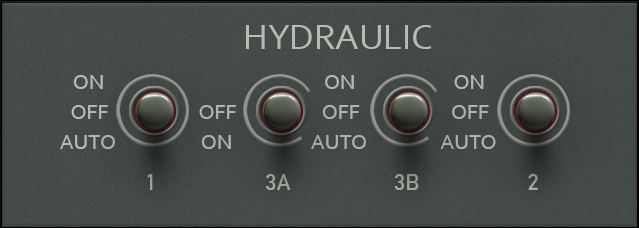 |
| Overhead-Ignition Panel | [v1.0 03-26-2022](https://github.com/Simstrumentation/Air-Manager/blob/main/Instruments/Bombardier_CRJ/CRJ-Overhead-Ignition_Panel/Bombardier_CRJ-Overhead-Ignition_Panel.siff?raw=true) | [docs](CRJ-Overhead-Ignition_Panel/) | 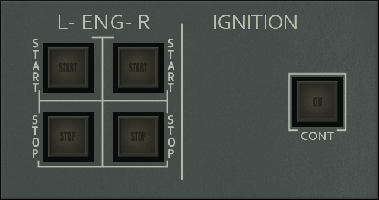 |
| Overhead-Landing Lights Panel | [v1.0 03-16-2022](https://github.com/Simstrumentation/Air-Manager/blob/main/Instruments/Bombardier_CRJ/CRJ-Overhead-Landing_Lights_Panel/Bombardier_CRJ-Overhead-Landing_Lights_Panel.siff?raw=true) | [docs](CRJ-Overhead-Landing_Lights_Panel/) |  |
| Overhead-Misc Lights Panel | [v1.0 03-24-2022](https://github.com/Simstrumentation/Air-Manager/blob/main/Instruments/Bombardier_CRJ/CRJ-Overhead-Misc_Lights_Panel/Bombardier_CRJ-Overhead-Misc_Lights_Panel.siff?raw=true) | [docs](CRJ-Overhead-Misc_Lights_Panel/) | 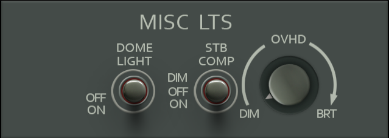 |
| Overhead-Pass & Emer Lights and ELT Panel | [v1.0 03-16-2022](https://github.com/Simstrumentation/Air-Manager/blob/main/Instruments/Bombardier_CRJ/CRJ-Overhead-Pass_&_Emer_Lights_and_ELT_Panel/Bombardier-CRJ-Overhead-Pass_Emer_Lights_and_ELT_Panel.siff?raw=true) | [docs](CRJ-Overhead-Pass_&_Emer_Lights_and_ELT_Panel/) | 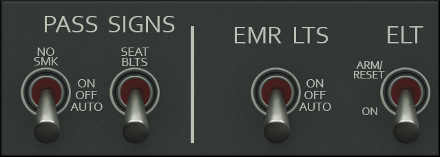 |

 

## Pedestal Instruments

| Instrument | Download Current Version | Documentation | Preview |
| ---------- | ------------------------ | ------------- | ------- |
| Pedestal-ATC Transponder Panel | [v1.0 06-07-2022](https://github.com/Simstrumentation/Air-Manager/blob/main/Instruments/Bombardier_CRJ/CRJ-Pedestal-ATC_Transponder_Panel/Bombardier_CRJ-Pedestal-ATC_Transponder_Panel.siff?raw=true) | [docs](CRJ-Pedestal-ATC_Transponder_Panel/) |  |
| Pedestal-Aileron Rudder Trim Panel | [v1.0 06-17-2022](https://github.com/Simstrumentation/Air-Manager/blob/main/Instruments/Bombardier_CRJ/CRJ-Pedestal-Aileron_Rudder_Trim_Panel/Bombardier_CRJ-Pedestal-Aileron_Rudder_Trim_Panel.siff?raw=true) | [docs](CRJ-Pedestal-Aileron_Rudder_Trim_Panel/) | 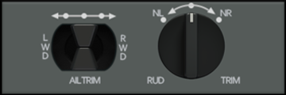 |
| Pedestal-Audio Control Panel | [v1.0 09-27-2022](https://github.com/Simstrumentation/Air-Manager/blob/main/Instruments/Bombardier_CRJ/CRJ-Pedestal-Audio_Control_Panel/Bombardier_CRJ-Pedestal-Audio_Control_Panel.siff?raw=true) | [docs](CRJ-Pedestal-Audio_Control_Panel/) |  |
| Pedestal-Blank Panel | [v1.0 09-19-2022](https://github.com/Simstrumentation/Air-Manager/blob/main/Instruments/Bombardier_CRJ/CRJ-Pedestal-Blank_Panel/Bombardier_CRJ-Pedestal-Blank_Panel.siff?raw=true) | [docs](CRJ-Pedestal-Blank_Panel/) |  |
| Pedestal-Cargo Firex Panel | [v1.0 06-21-2022](https://github.com/Simstrumentation/Air-Manager/blob/main/Instruments/Bombardier_CRJ/CRJ-Pedestal-Cargo_Firex_Panel/Bombardier_CRJ-Pedestal-Cargo_Firex_Panel.siff?raw=true) | [docs](CRJ-Pedestal-Cargo_Firex_Panel/) |  |
| Pedestal-EICAS Panel | [v1.0 06-17-2022](https://github.com/Simstrumentation/Air-Manager/blob/main/Instruments/Bombardier_CRJ/CRJ-Pedestal-EICAS_Panel/Bombardier_CRJ-Pedestal-EICAS_Panel.siff?raw=true) | [docs](CRJ-Pedestal-EICAS_Panel/) |  |
| Pedestal-Fan Selector Panel | [v1.0 06-08-2022](https://github.com/Simstrumentation/Air-Manager/blob/main/Instruments/Bombardier_CRJ/CRJ-Pedestal-Fan_Selector_Panel/Bombardier_CRJ-Pedestal-Fan_Selector_Panel.siff?raw=true) | [docs](CRJ-Pedestal-Fan_Selector_Panel/) | 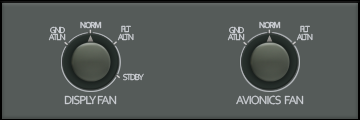 |
| Pedestal-Flight Desk Door Panel | [v1.0 04-18-2022](https://github.com/Simstrumentation/Air-Manager/blob/main/Instruments/Bombardier_CRJ/CRJ-Pedestal-Flight_Desk_Door_Panel/Bombardier_CRJ-Pedestal-Flight_Desk_Door_Panel.siff?raw=true) | [docs](CRJ-Pedestal-Flight_Desk_Door_Panel/) | 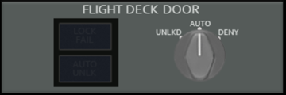 |
| Pedestal-HGS Control Panel | [v1.0 06-26-2022](https://github.com/Simstrumentation/Air-Manager/blob/main/Instruments/Bombardier_CRJ/CRJ-Pedestal-HGS_Control_Panel/Bombardier_CRJ-Pedestal-HGS_Control_Panel.siff?raw=true) | [docs](CRJ-Pedestal-HGS_Control_Panel/) |  |
| Pedestal-IRS Mode Panel | [v1.0 06-09-2022](https://github.com/Simstrumentation/Air-Manager/blob/main/Instruments/Bombardier_CRJ/CRJ-Pedestal-IRS_Mode_Panel/Bombardier_CRJ-Pedestal-IRS_Mode_Panel.siff?raw=true) | [docs](CRJ-Pedestal-IRS_Mode_Panel/) | 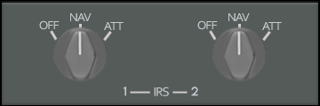 |
| Pedestal-Intercom Control Panel | [v1.0 09-19-2022](https://github.com/Simstrumentation/Air-Manager/blob/main/Instruments/Bombardier_CRJ/CRJ-Pedestal-Intercom_Control_Panel/Bombardier_CRJ-Pedestal-Intercom_Control_Panel.siff?raw=true) | [docs](CRJ-Pedestal-Intercom_Control_Panel/) | 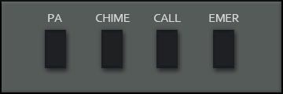 |
| Pedestal-Lighting Control Panel | [v1.0 06-20-2022](https://github.com/Simstrumentation/Air-Manager/blob/main/Instruments/Bombardier_CRJ/CRJ-Pedestal-Lighting_Control_Panel/Bombardier_CRJ-Pedestal-Lighting_Control_Panel.siff?raw=true) | [docs](CRJ-Pedestal-Lighting_Control_Panel/) | 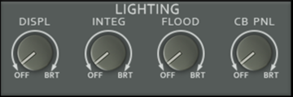 |
| Pedestal-Radio Tuning Unit | [v1.0 05-10-2022](https://github.com/Simstrumentation/Air-Manager/blob/main/Instruments/Bombardier_CRJ/CRJ-Pedestal-Radio_Tuning_Unit/Bombardier_CRJ-Pedestal-Radio_Tuning_Unit.siff?raw=true) | [docs](CRJ-Pedestal-Radio_Tuning_Unit/) | 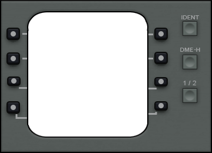 |
| Pedestal-Source Selector Panel | [v1.0 09-18-2022](https://github.com/Simstrumentation/Air-Manager/blob/main/Instruments/Bombardier_CRJ/CRJ-Pedestal-Source_Selector_Panel/Bombardier_CRJ-Pedestal-Source_Selector_Panel.siff?raw=true) | [docs](CRJ-Pedestal-Source_Selector_Panel/) | 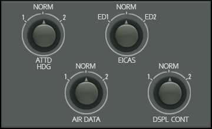 |
| Pedestal-StabMach Trim Panel | [v1.0 06-08-2022](https://github.com/Simstrumentation/Air-Manager/blob/main/Instruments/Bombardier_CRJ/CRJ-Pedestal-StabMach_Trim_Panel/Bombardier_CRJ-Pedestal-StabMach_Trim_Panel.siff?raw=true) | [docs](CRJ-Pedestal-StabMach_Trim_Panel/) |  |
| Pedestal-Weather Radar System Panel | [v1.0 09-19-2022](https://github.com/Simstrumentation/Air-Manager/blob/main/Instruments/Bombardier_CRJ/CRJ-Pedestal-Weather_Radar_System_Panel/Bombardier_CRJ-Pedestal-Weather_Radar_System_Panel.siff?raw=true) | [docs](CRJ-Pedestal-Weather_Radar_System_Panel/) | 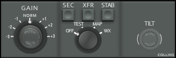 |
| Pedestal-Yaw Damper Panel | [v1.0 06-19-2022](https://github.com/Simstrumentation/Air-Manager/blob/main/Instruments/Bombardier_CRJ/CRJ-Pedestal-Yaw_Damper_Panel/Bombardier_CRJ-Pedestal-Yaw_Damper_Panel.siff?raw=true) | [docs](CRJ-Pedestal-Yaw_Damper_Panel/) |  |

## Ambient Light Dimming - Full Day / Night Cycle On Your CRJ Instruments

This instrument, will automatically follow ambient lighting in the sim and dim all your instruments background from full bright daytime lighting to nearly black dark mode for night lighting. It has an auto mode, or you can manually select the ambient light level with the knob in manual mode.
 

[THIS HAS BEEN MOVED TO A NEW LOCATION. CLICK HERE.] (https://github.com/Simstrumentation/Air-Manager/tree/main/Ambient_Light_Dimmer/)
 

