<h1 align="center">Cessena Citation CJ4 (Working Title)
</h1> 

This collection of Cessna Citation CJ4 instruments is currently our flagship and most complete instrument collection. It contains every instrument that you need to be able to use your CJ4 mouse and keyboard free. Each instrument and control has been meticulously crafted to give you a near perfect visual recreation of what you would see in your virtual cockpit, and all instruments replicate their in simulator functionality exactly.
<h4>NOTE - THESE INSTRUMENTS ARE DESIGNED TO BE USED WITH THE WORKING TITLE CJ4 MODIFICATION
</h4>While some of these instruments may function correctly with the stock CJ4 provided with MSFS, many functions are specific to the Working Title CJ4 modification and won't work on the stock aircraft. If you fly the CJ4 and aren't using the Working Title mod, you're most definitely missing out on one of the most complete and realistic flying experiences that MSFS has to offer. You can download the WT CJ4 mod package from <a href="https://www.workingtitle.aero/packages/cj4/" target="_blank">the Working Title CJ4 page</a>

## Main Panels & Instruments

| Instrument | Download Current Version | Documentation | Preview |
| ---------- | ------------------------ | ------------- | ------- |
| Audio Panel | [v2.0 - 10-06-2021](https://github.com/Simstrumentation/Air-Manager/blob/main/Instruments/Cessena_Citation_CJ4/CJ4-Audio_Panel/Cessna_Citation_CJ4_(Working_Title%20Mod)-Audio_Panel.siff) | [docs](CJ4-Audio_Panel/) | 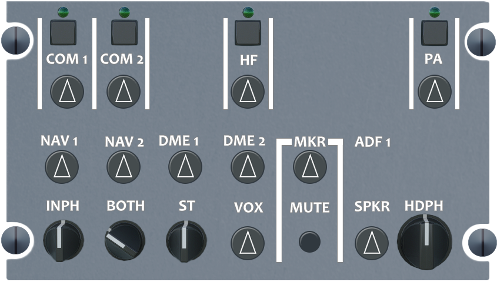 |
| Autopilot Panel | [v2.0 - 10-06-2021](https://github.com/Simstrumentation/Air-Manager/blob/main/Instruments/Cessena_Citation_CJ4/CJ4-AutoPilot_Panel/Cessna_Citation_CJ4_(Working_Title%20Mod)-AutoPilot_Panel.siff) | [docs](CJ4-AutoPilot_Panel/) | 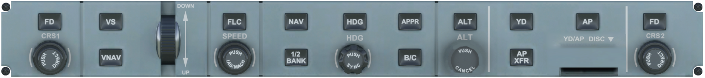 |
| Climate Control Knob | [v2.0 - 10-06-2021](https://github.com/Simstrumentation/Air-Manager/blob/main/Instruments/Cessena_Citation_CJ4/CJ4-Climate_Control/Cessna_Citation_CJ4_(Working_Title%20Mod)-Climate_Control_Switch.siff) | [docs](CJ4-Climate_Control/) | 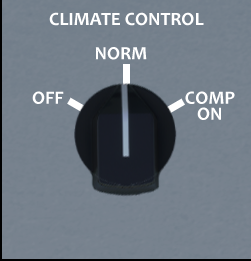 |
| Electrical Panel | [v2.0 - 10-06-2021](https://github.com/Simstrumentation/Air-Manager/blob/main/Instruments/Cessena_Citation_CJ4/CJ4-Electrical_Panel/Cessna_Citation_CJ4_(Working_Title%20Mod)-Electrical_Panel.siff) | [docs](CJ4-Electrical_Panel/) | 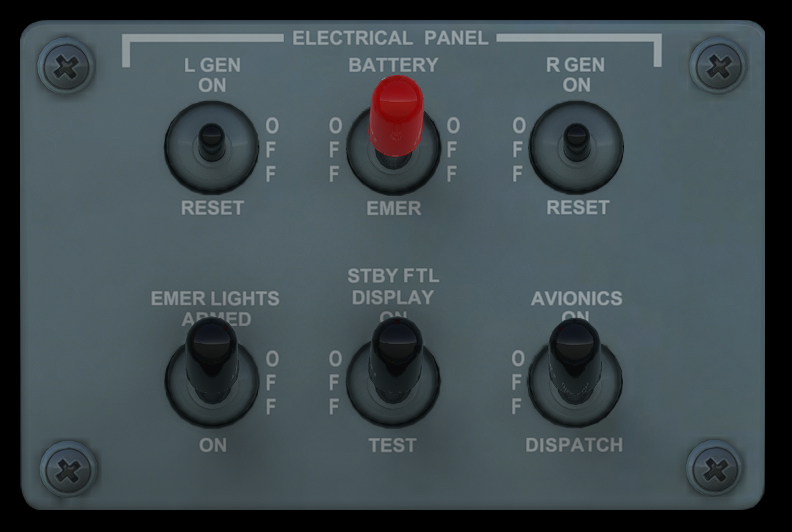 |
| Ice Protection Panel | [v2.0 - 10-06-2021](https://github.com/Simstrumentation/Air-Manager/blob/main/Instruments/Cessena_Citation_CJ4/CJ4-Ice_Protection_Panel/Cessna_Citation_CJ4_(Working_Title%20Mod)-Ice_Protection_Panel.siff) | [docs](CJ4-Ice_Protection_Panel/) |  |
| Landing Gear Handle | [2.0 - 10-06-2021](https://github.com/Simstrumentation/Air-Manager/blob/main/Instruments/Cessena_Citation_CJ4/CJ4-Landing_Gear_Handle/Cessna_Citation_CJ4_(Working_Title%20Mod)-Landing_Gear_Handle.siff) | [docs](CJ4-Landing_Gear_Handle/) | 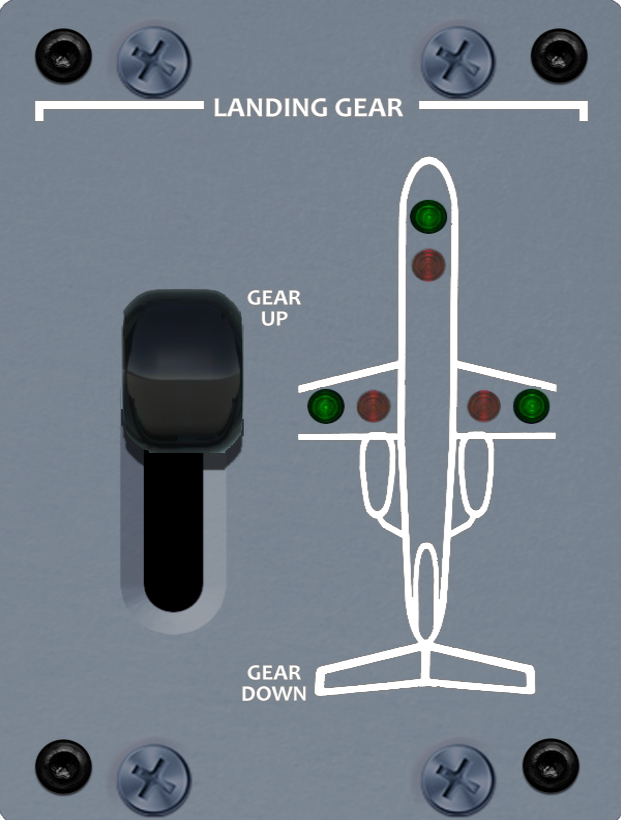 |
| Light Panel | [2.0 - 10-06-2021](https://github.com/Simstrumentation/Air-Manager/blob/main/Instruments/Cessena_Citation_CJ4/CJ4-Light_Panel/Cessna_Citation_CJ4_(Working_Title%20Mod)-Light_Panel.siff) | [docs](CJ4-Light_Panel/) | 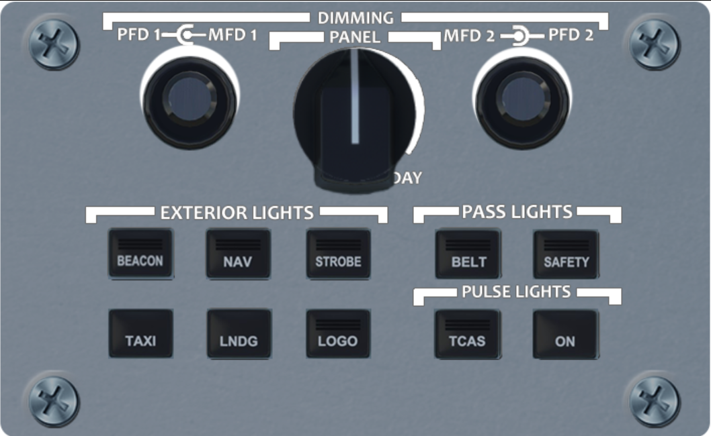 |  
| Lower CCP | [v2.0 - 10-06-2021](https://github.com/Simstrumentation/Air-Manager/blob/main/Instruments/Cessena_Citation_CJ4/CJ4-Lower_CCP_Panel/Cessna_Citation_CJ4_(Working_Title%20Mod)-Lower_CCP_Panel.siff) | [docs](CJ4-Lower_CCP_Panel/) | 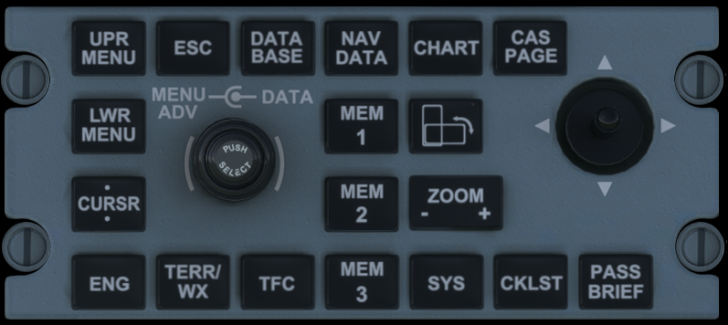 |
| Master Caution and Warning Buttons | [2.0 - 10-06-2021](https://github.com/Simstrumentation/Air-Manager/blob/main/Instruments/Cessena_Citation_CJ4/CJ4-Master_Caution_Warning/Cessna_Citation_CJ4_(Working_Title%20Mod)-Master_Caution_and_Warning.siff) | [docs](CJ4-Master_Caution_Warning/) | 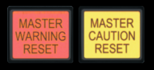 |
| Parking Brake | [v2.0 - 10-06-2021](https://github.com/Simstrumentation/Air-Manager/blob/main/Instruments/Cessena_Citation_CJ4/CJ4-Parking_Brake/Cessna_Citation_CJ4_(Working_Title%20Mod)-Parking_Brake.siff) | [docs](CJ4-Parking_Brake/) | 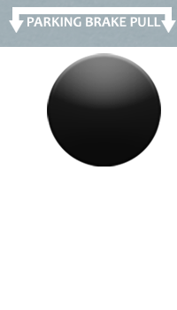 |
| PFD & MFD Overlays | [v2.0 - 10-06-2021](https://github.com/Simstrumentation/Air-Manager/blob/main/Instruments/Cessena_Citation_CJ4/CJ4-PFD_MFD_Overlay/Cessna_Citation_CJ4_(Working_Title%20Mod)-PFD_MFD_Overlay.siff) | [docs](CJ4-PFD_MFD_Overlay/) |  |
| Rockwel Collins Pro Line 21 FMS MCDU | [v2.0 - 10-06-2021](https://github.com/Simstrumentation/Air-Manager/blob/main/Instruments/Cessena_Citation_CJ4/CJ4-Rockwell_Collins_Pro_Line_21/Cessna_Citation_CJ4_(Working_Title%20Mod)-Rockwell_Collins_Pro_Line_21_FMS_MCDU_Overlay.siff) | [docs](CJ4-Rockwell_Collins_Pro_Line_21/) | 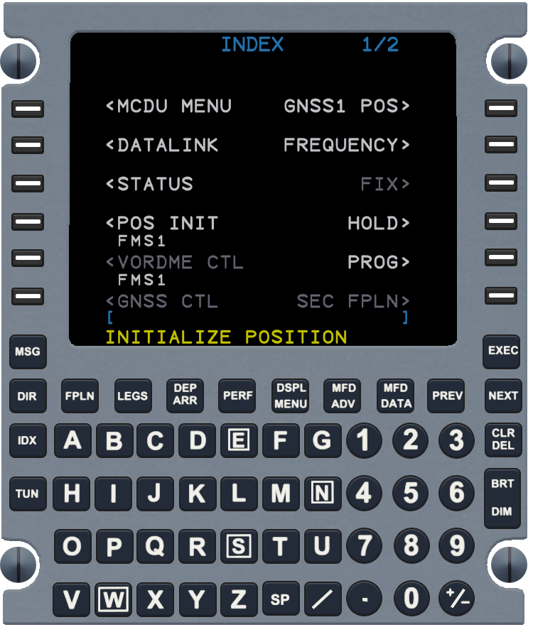 |
| Standby Flight Instrument Display | [v2.0 - 10-06-2021](https://github.com/Simstrumentation/Air-Manager/blob/main/Instruments/Cessena_Citation_CJ4/CJ4-Standby_Flight_Instrument/Cessna_Citation_CJ4_(Working_Title%20Mod)-Standby_Flight_Instrument_Overlay.siff) | [docs](CJ4-Standby_Flight_Instrument/) | 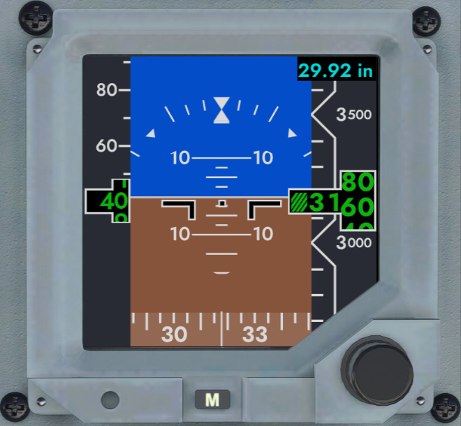 |
| Trim and Engine Control | [v2.0 - 10-06-2021](https://github.com/Simstrumentation/Air-Manager/blob/main/Instruments/Cessena_Citation_CJ4/CJ4-Trim_and_Engine_Control/Cessna_Citation_CJ4_(Working_Title%20Mod)-Trim_and_Engine_Control_Panel.siff) | [docs](CJ4-Trim_and_Engine_Control/) |  |
| Upper DCP | [v2.0 - 10-06-2021](https://github.com/Simstrumentation/Air-Manager/blob/main/Instruments/Cessena_Citation_CJ4/CJ4-Upper_DCP_Panel/Cessna_Citation_CJ4_(Working_Title%20Mod)-Upper_DCP_Menu.siff) | [docs](CJ4-Upper_DCP_Panel/) | 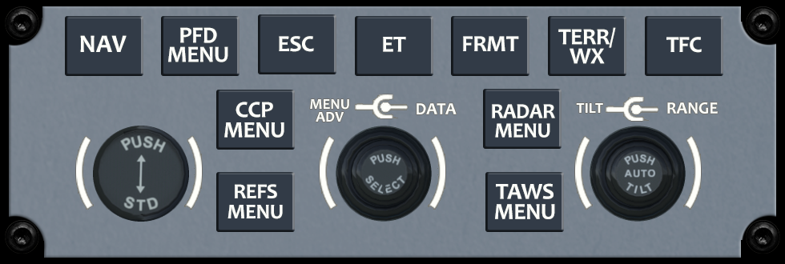 |

 
## Ambient Light Dimming - Full Day / Night Cycle On Your CJ4 Instruments

We've created a new instrument for the CJ4. While it isn't part of the cockpit normally, it's been created to look like an authentic CJ4 control and will fit inconspicuously in your panel. It also has the option of being a hidden control that won't appear on your screen at all.

This instrument, when used in conjunction with V2.0 or higher of our other CJ4 instruments, will automatically follow ambient lighting in the sim and dim all your instruments background from full bright daytime lighting to nearly black dark mode for night lighting. It has an auto mode, or you can manually select the ambient light level with the knob in manual mode.

| Instrument | Download Current Version | Documentation | Preview |
| Ambient Light Dimmer | [v2.0 - 10-06-2021](https://github.com/Simstrumentation/Air-Manager/blob/main/Instruments/Cessena_Citation_CJ4/CJ4-Ambient_Light_Dimmer/Cessna_Citation_CJ4_(Working_Title%20Mod)-Ambient_Light_Dimmer.siff) | [docs](CJ4-Ambient_Light_Dimmer/) |  |
 
###### These are some extra Instruments that are not nesessarily in the game, but are useful.

## Extra Panels & Instruments

###### These are some extra Instruments that are not nesessarily in the game, but are useful.

| Instrument | Current Version | Documentation | Preview |
| ---------- | --------------- | ------------- | ------- |
| Ground Power Unit GPU Knob | [9-18-2021 v1.0](https://github.com/Simstrumentation/Air-Manager/blob/main/Instruments/Cessena_Citation_CJ4/CJ4-GPU_Knob/Cessna_Citation_CJ4-GPU%20Knob.siff) | [docs](CJ4-GPU_Knob/) | 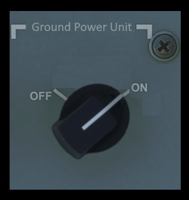 |

## Roadmap

See the [open issues](https://github.com/Simstrumentation/Air-Manager/issues) for a list of proposed features (and known issues).
