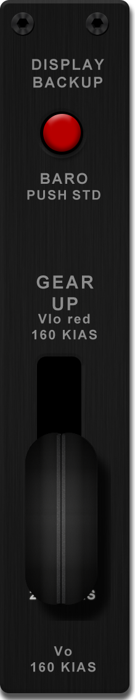
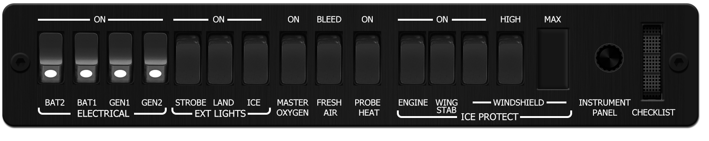

<!-- PROJECT LOGO -->

<!-- ABOUT THE PROJECT -->

<!-- PROJECT LOGO -->

  <h1 align="center">Cirrus SF50 Vision Jet G2 (Microsoft)</h1>

## About
This is a collection of instruments for the incredible Cirrus SF50 Vision Jet by Microsoft, new in MSFS 2024. This jet is the ultimate rich person's toy. It allows said person with <em>F-you</em> money to literally be able to look down on other rich people in their exotic cars from above and call them peasants! 

With this collection of instruments, plus our new G3000, GTC 580 bezels, and GFC500 Autopilot unit, you should have all the essential instruments required to fly the Vision Jet with minimal mouse and keyboard clicking required. 

There were quite a few changes from the FFX version on FS2020 to this new MS version in 2024. The FFX version is also still playable in 2024, and therefore we have to diffrerent set of instruments for the two different planes. For the FFX version, use the "VisionJest (FFX)" folder.

<!-- ABOUT THE PROJECT -->

## Working Instruments

Instrument | Current Version | Documentation | Preview
-------------|-----------------|--------------|--------------
Auto Throttle Panel | [12-31-2024 v1.0](Auto-throttle/Cirrus%20SF50%20Vision%20Jet%20(MS)%20-%20Auto-Throttle.siff) | [files](Auto-throttle) | 
 

Environmental Control System | [12-31-2024 v1.0](ECS\Cirrus%20SF50%20Vision%20Jet%20%28MS%29%20-%20Environmental%20Control%20System.siff) | [files](ECS) | 
 

Flap Actuator | [12-31-2024 v1.0](Flap_Actuator\Cirrus%20SF50%20Vision%20Jet%20%28MS%29%20-%20Flap%20Actuator.siff) | [files](Flap_Actuator) | 
 

Fuel Selector | [12-31-2024 v1.0](Fuel_Selector\Cirrus%20SF50%20Vision%20Jet%20%28MS%29%20-%20Fuel%20Selector.siff) | [files](Fuel_Selector) | 
 

Landing Gear | [12-31-2024 v1.0](Landing_Gear\Cirrus%20SF50%20Vision%20Jet%20%28MS%29%20-%20Landing%20Gear%20Panel.siff) | [files](Landing_Gear) | 
 

Start Control | [12-31-2024 v1.0](Start_Control\Cirrus%20SF50%20Vision%20Jet%20%28MS%29%20-%20Start%20Controls.siff) | [files](Start_Control) | 
 

Switch Panel | [12-31-2024 v1.0](Switch_Panel\Cirrus%20SF50%20Vision%20Jet%20%28MS%29%20-%20Switch%20Panel.siff) | [files](Switch_Panel) | 
 

## Extra instruments for this plane

These instruments are classified as "Generic" because they can be used in multiple planes, but are integral parts of the SF50 cockpit layout.

Instrument | Current Version | Documentation | Preview
-------------|-----------------|--------------|--------------
G3000 / 5000 Bezel| [12-06-2022 v1.2](https://github.com/Simstrumentation/Air-Manager/blob/main/Instruments/Generic/Generic-Garmin_G3000-5000_Bezel/Generic%20-%20Garmin%20G3000%20and%20G5000%20%20PFD%20MFD%20Bezel%20Overlay.siff?raw=true?raw=true)  | [docs](https://github.com/Simstrumentation/Air-Manager/tree/main/Instruments/Generic/Generic-Garmin_G3000-5000_Bezel) | 
 

GTC 580 Touch Panel Overlay| [12-11-2022 v1.0](https://github.com/Simstrumentation/Air-Manager/blob/main/Instruments/Generic/Generic-Garmin-GTC580/Generic%20-%20GTC%20580%20Overlay.siff?raw=true) | [docs](https://github.com/Simstrumentation/Air-Manager/tree/main/Instruments/Generic/Generic-Garmin-GTC580) | 
 

GFC 500 Autopilot | [06-07-2023 v1.14](https://github.com/Simstrumentation/Air-Manager/blob/main/Instruments/Generic/Generic-GFC500/Generic%20-%20Garmin%20GFC%20500%20autopilot%20.siff?raw=true) | [docs](https://github.com/Simstrumentation/Air-Manager/blob/main/Instruments/Generic/Generic-GFC500) | 
 

## Sample Layout
Just an example of how you can layout your instruments. In this case, I have a pair of 22" touch monitors for my main Air Manager screens, and a smaller 15.6" monitor being used as a centre pedestal.

## COMING SOON
- N/A. This collection is complete. 
